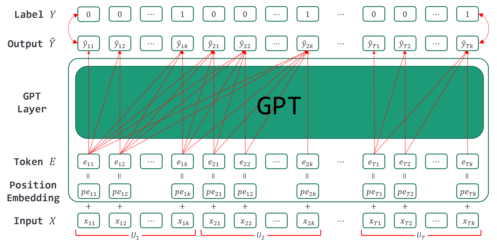

# Automatic Conversation Turn-Taking Segmentation in Semantic Facet
This repository provides the code for the paper **Automatic Conversation Turn-Taking Segmentation in Semantic Facet** (ICEIC2023) [[preprint](https://nbviewer.jupyter.org/github/dongin1009/semantic_turn_taking_segmentation/blob/main/Automatic_Conversation_Turn_Taking_Segmentation_in_Semantic_Facet.pdf)]. We propose a novel task to segment the conversation into turns and predict turn transition at the token level. Different from speech acoustic segmentation, conversation semantic turn-taking segmentation is more challenging. The main reason is that the semantic features of the conversation are more complex than the acoustic features. Also, this task simulates the environment of automatic speech recognition for smooth conversation. So we preprocess the conversation data as in `dataset.py`.
 
To make token level prediction, recurrent fashion models are used containing GPT-2, LSTM, GRU. Among them, GPT-2 is trained through the masked self-attention mechanism that masks the future token for current time point prediction. The GPT-2 model illustration is shown below.



We evaluate the models and task with this experiment. To proceed with the experiment, you need to install the requirements and run the `main.py` file.

## How to use
1. Clone the repository.
```bash
$ git clone https://github.com/dongin1009/semantic-turn-taking-prediction
```

2. Install requirements.
```bash
$ pip install -r requirements.txt
```

3. Run the `main.py` file.
```python
$ python main.py --model_type gpt2 --data_name multi_woz_v22 --epochs 500 --batch_size 16 --lr 1e-5 --patience 5

# or select the model type, dataset, and learning rate.
$ python main.py --model_type {gpt2, lstm, gru} --data_name {multi_woz_v22, daily_dialog} --epochs 500 --batch_size 16 --lr {1e-3, 1e-4, 1e-5} --patience 5
```

## Results
Here is the results of conversation datasets, [*MultiWoZ*](https://huggingface.co/datasets/multi_woz_v22) and [*DailyDialog*](https://huggingface.co/datasets/daily_dialog).
### *MultiWoZ* dataset

|     Model     |      lr       |    Recall     |   Precision   |   F1-score    |
| ------------- | ------------- | ------------- | ------------- | ------------- |
|     GPT-2     |     1e-5      |  **0.6725**   |  **0.7073**   |  **0.6894**   |
|     LSTM      |     1e-3      |    0.3840     |    0.6789     |    0.4906     |
|     GRU       |     1e-3      |    0.3220     |    0.6136     |    0.4224     |


### *DailyDialog* dataset

|     Model     |      lr       |    Recall     |   Precision   |   F1-score    |
| ------------- | ------------- | ------------- | ------------- | ------------- |
|     GPT-2     |     1e-5      |  **0.6046**   |  **0.6138**   |   **0.6092**  |
|     LSTM      |     1e-4      |    0.2724     |    0.7836     |     0.4042    |
|     GRU       |     1e-4      |    0.2616     |    0.8052     |     0.3949    |


## Citation
```bibtex
@INPROCEEDINGS{jung2023turntaking,
  title={Automatic Conversation Turn-Taking Segmentation in Semantic Facet},
  author={Jung, Dongin and Cho, Yoon-Sik},
  booktitle={2023 International Conference on Electronics, Information, and Communication (ICEIC)}, 
  year={2023},
  pages={1-4},
  doi={10.1109/ICEIC57457.2023.10049858}}
```

## Contact
If you have any questions, please contact us via email: [dongin1009@gmail.com](mailto:dongin1009@gmail.com)
